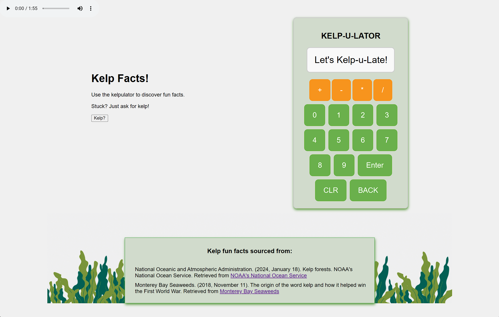
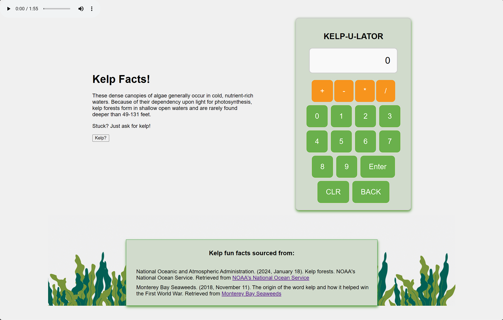

# KelpULator

```javascript
/* A simple calculator that displays fun facts about kelp! */

const kelp = "super impressive plant!";
```

## TOP Calculator Implementation

This project is an implemnentaiton of the Foundations Course capstone project.

The calculator can support simple math operations (add, subtract, divide, multiply) and accepts input from both clicking the buttons and pressing the corresponding keys on the keyboard.

Everytime the user presses enter, a random fun fact about kelp will display on the screen. Additionally the page features relaxing sounds waves breaking on the ocean that will loop after the user decides to hit play.

## KelpULator Landing Page



## Example Kelp Fact



## Kelp Fun Fact Sources

- National Oceanic and Atmospheric Administration. (2024, January 18). Kelp forests. NOAA's National Ocean Service.
Retrieved from <https://oceanservice.noaa.gov/facts/kelp.html>

- Monterey Bay Seaweeds. (2018, November 11). The origin of the word kelp and how it helped win the First World War. Retrieved from <https://www.montereybayseaweeds.com/the-seaweed-source/2018/11/11/the-origin-of-the-word-kelp-and-how-it-helped-win-the-first-world-war>
